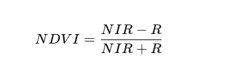

# Kleur detecteren

Dit is nodig om te bekijken welke bomen gezond zijn of niet. Dit doen we aan de hand van de NDVI(Normalized Difference Vegetation Index).

## NDVI (Normalized Difference Vegetation Index)

De **Normalized Difference Vegetation Index (NDVI)** is een maatstaf die wordt gebruikt om de gezondheid van vegetatie te evalueren op basis van satelliet- of luchtfoto's. NDVI maakt gebruik van de reflectie in twee belangrijke spectrale banden: het rode licht (R) en het nabij-infrarode licht (NIR). De formule voor NDVI is:

Waarbij:
- **NIR** de reflectie in het nabij-infrarode spectrum is (meestal band 3),
- **R** de reflectie in het rode spectrum is (meestal band 1).

### Interpretatie van NDVI-waarden:
- **Gezonde vegetatie**: NDVI-waarden tussen **0.2** en **0.9** duiden op aanwezigheid van gezonde vegetatie. Hoe dichter bij **1**, hoe gezonder de vegetatie.
- **Kale grond of geen vegetatie**: NDVI-waarden tussen **0.0** en **0.2** wijzen vaak op kale grond of gebieden zonder vegetatie.
- **Water**: NDVI-waarden tussen **-0.3** en **0.1** worden vaak geassocieerd met waterlichamen.
- **Zieke of dode vegetatie**: NDVI-waarden onder **0.2** kunnen wijzen op ongezonde of dode vegetatie.
 